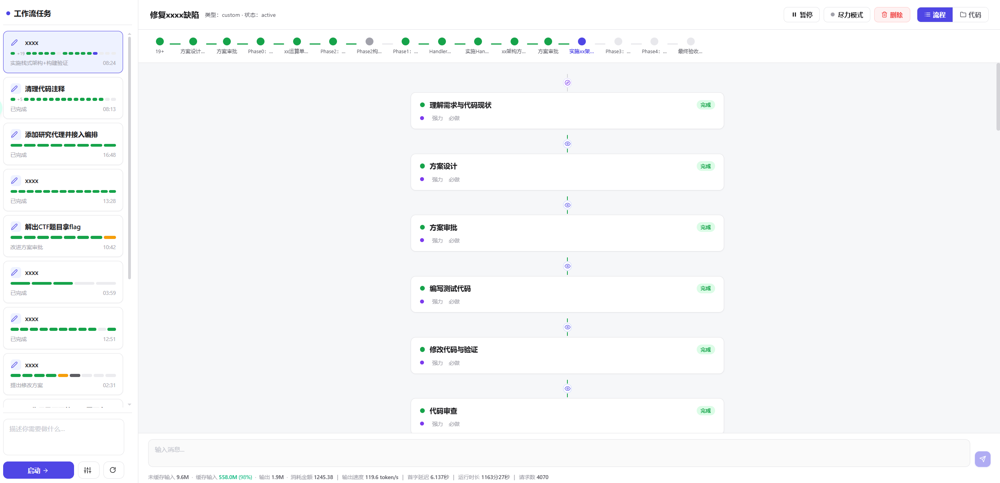

# DimensionCoder

> AI 驱动的自动化编码助手平台 — 多步骤任务编排、LLM 集成、代码审查、实时流式交互

DimensionCoder 是一款内网自用的 AI 编程辅助工具，以任务卡片方式管理 AI 代码修改，并提供实时状态流与文件变更管理。采用单进程架构：浏览器 → Python 单进程，由 Python 同时托管前端静态资源（`frontend/dist`）、REST API（`/api/*`）与 SSE 事件流（`/sse`），无独立
Node/前端服务器。

```
┌──────────┐  HTTP / SSE   ┌──────────────────────────────────────┐
│  浏览器    │ ───────────▶ │         Python 单进程（8501 端口）      │
│ Chrome/  │ ◀─────────── │  · 托管前端 frontend/dist             │
│  Edge    │              │  · REST API（/api/*）                 │
└──────────┘              │  · SSE 事件流（/sse）                 │
                          └──────────────────────────────────────┘
```



## 功能特性

- **多步骤任务编排**：9 种步骤类型（executor / gate / plan / code_review / reverse / researcher / monitor / review / report），支持自定义工作流
- **双模型 LLM**：light / power 分层调度，支持 OpenAI 兼容 API 与 Gemini 原生协议
- **10 个通用工具 + 5 个 CTF/逆向工具**：文件读写、代码搜索、命令执行、步骤管理；常量提取、字节搜索、Z3 求解、反编译、二进制模拟
- **实时流式交互**：SSE 推送流式文本、工具调用、思考过程
- **Gate 审批工作流**：人工干预（发送消息 / 强制注入 / 停止执行）
- **记忆 / 知识系统**：向量嵌入、语义召回、知识整合
- **CTF / 逆向工程工具**：加密常量提取、字节搜索、Z3 求解
- **二进制模拟器**：Windows PE 模拟、反混淆、符号执行
- **内置 Monaco 代码编辑器** + 文件树浏览
- **优雅关闭与重启恢复**

## 亮点

DimensionCoder 不同于 Cursor、GitHub Copilot、Windsurf、Cline/Continue 等以「对话补全」或「多文件编辑」为核心的 AI IDE 工具，它是一个以**全流程自主编排**为核心的 AI 编码平台。以下是核心差异对比：

### 核心能力对比

| 能力维度 | DimensionCoder | Cursor | GitHub Copilot | Windsurf | Cline / Continue |
|----------|---------------|--------|---------------|----------|-----------------|
| **流程编排** | Monitor Agent 自动设计多步骤流程，按需插入审查与审批步骤 | 用户手动逐轮引导 | 无流程编排 | Cascade 多文件编辑（用户发起） | 用户手动逐轮引导 |
| **步骤结构** | 9 种结构化步骤类型，步骤间有依赖关系，支持并行步骤 | 单轮对话 + 行内补全 | 代码补全 + Chat 对话 | Cascade 多文件编辑会话 | 自主编码循环 |
| **人工审批** | Gate 步骤支持结构化审批门控（批准/拒绝/强制注入/停止） | 无结构化审批，用户随时打断 | 无审批机制 | 无结构化审批 | 用户确认后才执行 |
| **跨步骤记忆** | 关键发现自动捕获、持久化并在后续步骤自动注入；向量嵌入语义召回 | 无跨对话记忆 | 无跨对话记忆 | 有限上下文记忆 | 无跨对话记忆 |
| **模型选择** | 双模型分层（light/power），按步骤复杂度自动选择 | 单模型（用户选择） | 单模型 | 单模型 | 单模型 |
| **逆向工程** | 内置 CTF 工具（常量提取、字节搜索、Z3 求解）+ Unicorn 二进制模拟器 | 无 | 无 | 无 | 无 |
| **架构形态** | 独立平台（50 REST 端点 + 15 内置工具 + SSE 流式） | IDE 插件 | IDE 插件 | IDE 插件 | IDE 插件 |

### 详细说明

#### 1. 全流程自主编排 vs 手动引导

DimensionCoder 的 Monitor Agent 在每个执行步骤完成后自动插入审查步骤，审查通过 `dcflow_adjust_flow` 工具自主决策后续流程：跳过已完成步骤、追加新步骤、调整步骤顺序、标记完成。用户只需给出任务描述，系统自动设计从调研→规划→执行→审查→报告的完整流程。

现有 AI IDE 工具（Cursor、Copilot、Cline 等）需要用户在每一轮对话中手动引导 AI 的行为：描述需求、检查输出、指出错误、要求修改。用户始终是流程的驱动者，AI 只是被动的执行者。

#### 2. 结构化多步骤 vs 单轮对话

DimensionCoder 定义了 9 种步骤类型，每种类型有专属的系统提示词和工具集：

| 步骤类型 | 职责 | 模型层级 | 专属工具 |
|----------|------|----------|----------|
| `executor` | 执行编码工作 | light | 文件读写/搜索/命令执行 |
| `gate` | 人工审批门控 | power | 只读审查工具 |
| `plan` | 制定方案 | light | 文件读取/搜索/文档 |
| `code_review` | 代码审查 | light | 只读审查工具 |
| `reverse` | 逆向分析 | light | CTF 工具 + 模拟器 + 编码工具 |
| `researcher` | 调研信息 | light | 只读调研工具 |
| `monitor` | 流程审查与编排 | power | 步骤管理 + 文件读取 |
| `review` | 最终审查 | power | 步骤管理 + 文件读取 |
| `report` | 产出报告 | power | 步骤管理 + 文件读取 |

步骤之间存在依赖关系和排序，支持并行步骤。每个步骤有独立的状态流转（pending → active → completed/skipped/stopped），产出物持久化并可供后续步骤读取。

现有 AI IDE 工具主要以单轮对话为单位工作，缺乏步骤间的结构化依赖和状态管理。

#### 3. 人工审批门控 vs 全自动无控

DimensionCoder 的 Gate 步骤提供结构化审批机制：

- **方案审批**：AI 产出方案后，系统自动生成审批报告（含选项、推荐），等待用户选择
- **执行审批**：关键决策点插入 Gate 步骤，用户可批准、拒绝、或发送消息引导
- **强制注入**：用户可在步骤执行过程中强制注入新指令
- **停止执行**：用户可随时停止正在执行的步骤

现有 AI IDE 工具中，Cursor 和 Windsurf 的 AI 在用户确认后全自动执行，缺乏中间审批点；Copilot 仅提供补全和对话，无执行流程。

#### 4. 跨步骤记忆系统 vs 无状态

DimensionCoder 实现了两层记忆机制：

- **关键发现持久注入**：系统通过正则匹配自动从 AI 输出中提取「关键发现」（如 API 接口、配置项、错误根因），持久化为 artifact，并在后续步骤的系统提示中自动注入。后续步骤无需重新调研已确认的结论。
- **向量记忆召回**：基于 OpenAI text-embedding-3-small 或 Gemini 嵌入模型，通过余弦相似度进行语义检索，结合关键词搜索、图谱搜索、时序搜索，经 RRF（Reciprocal Rank Fusion）融合排序后返回最相关的知识。

现有 AI IDE 工具在对话结束后上下文即丢失，跨文件、跨会话的知识无法持久积累。

#### 5. 双模型分层 vs 单模型

DimensionCoder 为每个步骤自动选择 LLM 层级：

- **light 模型**：用于 executor / plan / code_review / researcher / reverse 等执行类步骤（轻量、快速、低成本）
- **power 模型**：用于 gate / monitor / review / report 等审查编排类步骤（高能力、深度推理）

用户只需配置两组 LLM（light + power），系统按步骤类型自动路由。现有 AI IDE 工具通常使用单一模型，无法按任务复杂度分层调度。

#### 6. 逆向工程能力 vs 纯代码生成

DimensionCoder 内置专业逆向工程工具集，现有 AI IDE 工具均不具备：

| 工具 | 功能 |
|------|------|
| `dcflow_extract_constants` | 扫描二进制提取密码学常量，匹配 MD5/SHA/AES/DES/CRC/RC4/TEA 等 S-Box |
| `dcflow_search_bytes` | 通配符字节搜索（如 `41 41 ?? 00`） |
| `dcflow_get_decompiled_code` | 基于 angr 的反编译，返回伪代码 |
| `dcflow_solve_z3` | Z3 约束求解器，独立进程执行求解脚本 |
| `dcflow_sim` | Unicorn 引擎驱动的 x86 PE 模拟器，支持反混淆与符号执行 |

这使得 DimensionCoder 不仅限于代码生成与编辑，还能处理 CTF 竞赛、恶意软件分析、二进制逆向等专业场景。

## 技术栈

| 层 | 技术 | 版本 |
|----|------|------|
| 后端框架 | FastAPI | 0.115.0 |
| ASGI 服务器 | Uvicorn (standard) | 0.32.0 |
| LLM SDK | OpenAI Python SDK | 1.40.0 |
| SSE | sse-starlette | 2.1.0 |
| Token 计数 | tiktoken | 0.7.0 |
| 数据库 | SQLite（内置） | — |
| 前端框架 | React | 18.3.1 |
| 构建工具 | Vite | 5.3.3 |
| 代码编辑器 | Monaco Editor | 0.49.0 |
| 前端路由 | react-router-dom | 6.24.0 |
| 类型系统 | TypeScript | 5.5.3 |
| 测试 | pytest / Vitest / Playwright | — |
| Python | > = 3.9 | — |

## 快速开始

### 环境要求

- **操作系统**：Windows 10/11 或 Server 2019+
- **Python**：>= 3.9（仅 Python，服务器运行时零 Node）。推荐安装官方 Python 安装包（含 py launcher）
- **Node.js**：仅开发/构建期需要；交付包已包含 `frontend/dist/` 构建产物，服务器运行时无需安装 Node
- **网络**：服务器需能访问 LLM 服务（如 DeepSeek/通义等 OpenAI 兼容端点），首次安装依赖需联网

### 安装

1. 将整个 `dimensioncoder-web/` 文件夹复制到服务器（保持目录结构完整）
2. 双击运行 `install.bat`：自动检查 Python 并安装依赖（`pip install -r requirements.txt`）
    - 若 pip 下载慢或失败，可改用镜像源：`pip install -r requirements.txt -i https://pypi.tuna.tsinghua.edu.cn/simple`

### 启动

双击运行 `start.bat`（或命令行执行），打印 `DIMENSIONCODING_PORT:8501` 即启动成功。

启动脚本会依次检查：

- 前端构建产物（`frontend/dist/`）是否存在
- Python 依赖是否已安装
- 端口 8501 是否被占用

启动后，在浏览器访问 `http://localhost:8501`（本机）或 `http://服务器IP:8501`（其他电脑）。

### 停止

在运行 `start.bat` 的窗口中按 `Ctrl+C`，服务优雅退出（正在运行的任务会先中止）。

## 配置说明

### config.json

从 `config.example.json` 复制为 `config.json` 后按需修改：

```json
{
   "lightModel": "deepseek-v4-flash",
   "powerModel": "glm-5.2",
   "projectRoot": "E:\\workspace",
   "contextWindow": 1048576,
   "lightBaseUrl": "https://api.deepseek.com/v1",
   "powerBaseUrl": "https://api.deepseek.com/v1",
   "lightApiKey": "sk-123456",
   "powerApiKey": "sk-123456",
   "lightInputPrice": 3,
   "lightCachedPrice": 0.1,
   "lightOutputPrice": 9,
   "powerInputPrice": 8,
   "powerCachedPrice": 2,
   "powerOutputPrice": 28
}
```

| 字段 | 说明 | 默认值 |
|------|------|--------|
| `lightModel` | light 模型名称（轻量任务） | `deepseek-v4-flash` |
| `powerModel` | power 模型名称（复杂任务） | `glm-5.2` |
| `projectRoot` | 工作区根路径 | `E:\workspace` |
| `contextWindow` | 上下文窗口大小（token 数） | `1048576` |
| `lightBaseUrl` | light 模型 API 基础 URL | `https://api.deepseek.com/v1` |
| `powerBaseUrl` | power 模型 API 基础 URL | `https://api.deepseek.com/v1` |
| `lightApiKey` | light 模型 API Key | `sk-123456`（需替换为实际 Key） |
| `powerApiKey` | power 模型 API Key | `sk-123456`（需替换为实际 Key） |
| `lightInputPrice` | light 模型输入价格（元/百万 token） | `3` |
| `lightCachedPrice` | light 模型缓存价格 | `0.1` |
| `lightOutputPrice` | light 模型输出价格（元/百万 token） | `9` |
| `powerInputPrice` | power 模型输入价格（元/百万 token） | `8` |
| `powerCachedPrice` | power 模型缓存价格 | `2` |
| `powerOutputPrice` | power 模型输出价格（元/百万 token） | `28` |

> **注意**：`config.json` 含明文 API Key，已被 `.gitignore` 排除，请勿提交到版本库。

### 环境变量

环境变量可覆盖 config.json 中的配置：

| 环境变量 | 说明 | 默认值 |
|----------|------|--------|
| `DIMENSIONCODING_PORT` | 服务端口 | `8501` |
| `DIMENSIONCODING_HOST` | 监听地址 | `0.0.0.0` |
| `DIMENSIONCODING_DB_PATH` | SQLite 路径 | `python-backend/data/dimensioncoding.db` |
| `DIMENSIONCODING_PROJECT_ROOT` | 工作区根路径 | `python-backend/workspace` |
| `LLM_BASE_URL` | LLM API URL | config.json `baseUrl` |
| `LLM_API_KEY` | LLM API Key | config.json `apiKey` |
| `LLM_LIGHT_BASE_URL` | light 模型 URL | `baseUrl` |
| `LLM_LIGHT_API_KEY` | light 模型 Key | `apiKey` |
| `LLM_POWER_BASE_URL` | power 模型 URL | `baseUrl` |
| `LLM_POWER_API_KEY` | power 模型 Key | `apiKey` |
| `LLM_LIGHT_MODEL` | light 模型名 | config.json `lightModel` |
| `LLM_POWER_MODEL` | power 模型名 | config.json `powerModel` |
| `DC_CORS_ORIGINS` | CORS 允许来源 | `localhost:8501,127.0.0.1:8501` |

## 项目结构

```
dimensioncoder-web/
├── install.bat                  # 一键安装脚本（pip install Python 依赖）
├── start.bat                    # 启动脚本（单进程 Python，含前端构建产物/依赖/端口预检）
├── config.example.json          # 配置示例（复制为 config.json 后按需修改）
├── config.json                  # 实际配置（含 API Key，已被 .gitignore 排除）
├── .gitignore                    # Git 忽略规则
├── README.md                     # 本文档
├── python-backend/              # Python 后端全部源码
│   ├── requirements.txt          # Python 依赖清单
│   ├── pyproject.toml            # Python 项目配置
│   ├── data/                     # SQLite 数据库目录（已被 .gitignore 排除）
│   ├── workspace/                # 默认工作区目录（存放待修改项目代码）
│   ├── tests/                    # 后端测试
│   └── dc_server/                # 核心服务包
│       ├── server.py             # ASGI 入口
│       ├── rest_api.py           # REST API（50 端点）
│       ├── config.py             # 配置与环境变量入口
│       ├── API.md                # API 契约文档（50 端点表 + 15 工具表）
│       ├── step_context.py       # 步骤上下文
│       ├── monitor_context.py    # 监控上下文
│       ├── graceful.py           # 优雅关闭
│       ├── tool_security.py      # 工具安全
│       ├── brain/                # LLM 客户端与编排器
│       │   ├── llm_client.py     # LLM 客户端（OpenAI/Gemini 兼容）
│       │   ├── orchestrator.py    # 任务编排器
│       │   └── sse_hub.py        # SSE 事件中心
│       ├── models/               # 数据模型
│       ├── memory/               # 记忆/知识系统
│       ├── prompts/              # 提示词模板
│       ├── state_machine/        # 步骤状态机
│       ├── storage/              # 持久化存储
│       ├── ctf_tool/             # CTF/逆向工程工具
│       └── simulator/            # 二进制模拟器
├── frontend/                     # React 前端
│   ├── package.json              # 前端依赖与脚本
│   ├── .gitignore                # 前端 Git 忽略（node_modules/dist）
│   ├── src/
│   │   ├── App.tsx               # 应用入口
│   │   ├── main.tsx              # React 渲染入口
│   │   ├── api/                  # API 调用层
│   │   ├── components/           # 通用组件
│   │   ├── config/               # 配置管理
│   │   ├── editor/               # Monaco 编辑器封装
│   │   ├── hooks/                # React Hooks
│   │   ├── panels/               # 面板组件
│   │   ├── theme/                 # 主题样式
│   │   ├── utils/                # 工具函数
│   │   └── tests/                # 前端测试
│   ├── dist/                     # 前端构建产物（由 Python 静态托管）
│   └── tests/                    # 端到端/视觉测试
```

## 使用指南

### 创建任务

通过侧边栏新建任务，选择任务类型（`custom` 自定义流程或预设类型）。任务以卡片形式展示在侧边栏，点击卡片进入详情。

### 步骤执行流程

每个任务由多个步骤组成，步骤状态流转：`pending` → `active` → `completed` / `skipped` / `stopped`

- **executor**：执行者步骤，AI 完成具体编码工作
- **gate**：审批步骤，等待用户审批（批准/拒绝）
- **plan**：规划步骤，制定方案
- **code_review**：代码审查步骤
- **researcher**：调研步骤，收集信息
- **reverse**：逆向分析步骤
- **monitor**：监控步骤
- **review**：审查步骤
- **report**：报告步骤

### LLM 配置

通过设置页配置 LLM：

- **Base URL / API Key**：LLM API 基础配置
- **lightModel / powerModel**：双模型配置（light 用于轻量任务，power 用于复杂任务）
- **New API 通道**：支持粘贴 New API 通道 JSON 快速配置

### 工具系统

AI 在执行步骤时可调用 10 个通用工具 + 5 个 CTF/逆向工具：

**通用工具**

| 工具 | 用途 |
|------|------|
| `dcflow_list_dir` | 浏览目录结构 |
| `dcflow_read_file` | 读取文件内容 |
| `dcflow_write_file` | 写入/创建文件 |
| `dcflow_edit_file` | 精准替换文件文本 |
| `dcflow_search_code` | 正则搜索代码 |
| `dcflow_run_cmd` | 执行 shell 命令 |
| `dcflow_read_doc` | 读取知识库文档 |
| `dcflow_step_done` | 标记步骤完成 |
| `dcflow_list_steps` | 列出任务步骤 |
| `dcflow_adjust_flow` | 调整流程（跳过/添加/移除步骤等） |

**CTF / 逆向工具**

| 工具 | 用途 |
|------|------|
| `dcflow_extract_constants` | 扫描二进制提取密码学常量，匹配 S-Box |
| `dcflow_search_bytes` | 通配符字节搜索 |
| `dcflow_get_decompiled_code` | 基于 angr 的反编译，返回伪代码 |
| `dcflow_solve_z3` | Z3 约束求解器，独立进程执行求解脚本 |
| `dcflow_sim` | Unicorn 引擎驱动的 x86 PE 模拟器，支持反混淆与符号执行 |

## 开发指南

### 前端开发

```bash
cd frontend
npm install
npm run dev        # 开发模式（热更新）
npm run build      # 构建生产产物到 dist/
```

### 后端测试

```bash
cd python-backend
python -m pytest                          # 运行全部测试
python -m pytest tests/ -v                # 详细模式
python -m pytest tests/test_config_newapi.py  # 运行单个测试文件
```

### 前端测试

```bash
cd frontend
npm run test        # 运行 Vitest 单元测试
npx playwright test  # 运行 E2E 测试
```

## REST API 概览

后端提供 50 个 REST 端点，完整契约详见 [`python-backend/dc_server/API.md`](python-backend/dc_server/API.md)。

主要端点：

| 方法 | 路径 | 用途 |
|------|------|------|
| `GET` | `/api/health` | 健康检查 |
| `POST` | `/api/task` | 创建任务 |
| `GET` | `/api/tasks` | 获取任务列表 |
| `GET` | `/api/task/{id}` | 获取任务详情 |
| `DELETE` | `/api/task/{id}` | 删除任务 |
| `POST` | `/api/step/prepare` | 准备步骤执行 |
| `POST` | `/api/step/submit` | 提交步骤完成 |
| `POST` | `/api/tool/invoke` | 调用工具 |
| `POST` | `/api/step/advance` | 推进步骤（审批/状态变更） |
| `POST` | `/api/intervene/step` | 人工干预步骤 |
| `GET` | `/sse` | SSE 事件流 |

## 安全提示

本工具定位为内网自用形态：**无鉴权**，**勿暴露到公网**。Python 默认绑定 `0.0.0.0`，仅供内网其他电脑访问；请勿将其部署到公网或不可信网络，否则任意访问者可操作工作区文件并读取/调用配置的 LLM Key。

- `config.json` 含明文 API Key，已被 `.gitignore` 排除
- SQLite 数据库文件（`*.db`）已被 `.gitignore` 排除
- `__pycache__/` 编译缓存已被 `.gitignore` 排除
